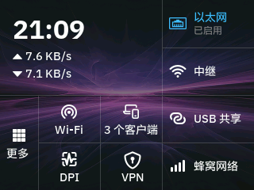

# GL-BE14000 screen zh-CN language pack

Unofficial Simplified Chinese screen language pack for GL.iNet GL-BE14000.

## Device screenshot



Actual device framebuffer capture after installing test build `2026.10.01.130556`.

## Compatibility

| Item | Required / inspected version |
| --- | --- |
| Device | GL-BE14000 |
| GL.iNet firmware | 4.9.2 (build number not established) |
| OpenWrt | 21.02-SNAPSHOT |
| Original screen package | gl-sdk4-screen-large git-2026.208.53992-2c8f014-1 |

The package requires the exact screen package version. Do not force dependency overrides.
Installation and upgrade have been tested on the device. The home screen was
visually checked; other screens and package removal still need validation.

## Build

```sh
pip install -r requirements.txt
python scripts/validate_zh_cn.py
python scripts/prepare_overlay.py
python scripts/build_ipk.py
```

The builder requires OpenWrt's official `ipkg-build` script in PATH.
GitHub Actions builds IPKs for pull requests. Releases are created only by
an owner-triggered workflow dispatch on main, after device testing.

## Install and remove

```sh
opkg install gl-screen-be14000-i18n-zh-cn_<version>_all.ipk
opkg remove gl-screen-be14000-i18n-zh-cn
```

Installation backs up the original language file, installs the translation and
IBM Plex Sans SC fonts, and restarts gl_screen. Removal restores the backup.
The payload is limited to `/etc/gl_screen/language`.

Original device files and downloaded IPKs live outside this Git repository.
Only numeric font metrics are committed; stock font binaries are not redistributed.
See THIRD_PARTY_NOTICES.md for licenses and attribution.
